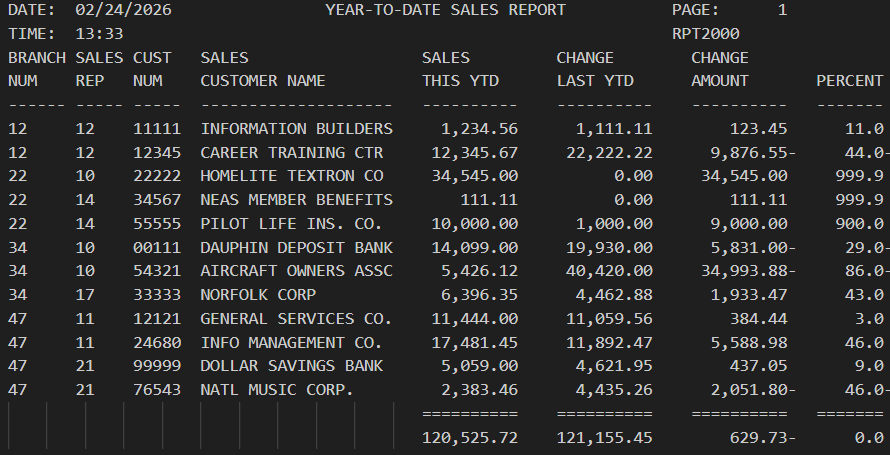

# COBOL RPT2000
___

## Overview
___
The **RPT2000** program is an enhanced COBOL reporting tool. It serves as a data processing utility that reads customer financial records from a master input file (`CUSTMAST`) and generates a formatted, multi-columnar Year-To-Date (YTD) Sales Report.

Building upon the foundations of its predecessor (RPT1000), this version introduces comparative financial analytics by calculating the variance between current and previous year sales performance.

### Key Functionalities
* **Data Transformation:** Processes raw record data, including branch numbers, sales representative IDs, and customer names.
* **Comparative Analytics:** Calculates the **Change Amount** (Current YTD - Last YTD) and the **Change Percent** for every customer.
* **Grand Totals:** Aggregates all individual customer metrics to provide a final summary of total company performance.
* **Automated Formatting:** Features a dynamic page-breaking system, standardized headers with real-time date/time stamps, and clean visual separators using COBOL `ALL` clauses.

## Table of Contents
___
* [Tech Stack](#tech-stack)
* [Installation](#installation)
* [Running Output](#running-output)
* [Learning Outcomes](#learning-outcomes)
* [Help](#help)
* [Authors](#authors)

## Tech Stack
___
* 
* 
* 

## Installation
___
1. Clone the repository to your local machine. (or just steal my code)
2. Put the code into VS Code in your mainframe of choice

## Running Output
___

## Learning Outcomes
___

* **Arithmetic Processing:** Implementation of `SUBTRACT` and `COMPUTE` statements for financial variance analysis.
* **Zero-Division Guarding:** Logic-based checks to prevent system crashes when calculating percentages for customers with no sales history.
* **JCL Step Integration:** Precise synchronization between internal COBOL File Control and external Job Control Language (JCL) DD names.
* **Advanced Data Editing:** Utilization of numeric-edited pictures (e.g., `ZZ,ZZ9.99-`) to ensure professional accounting-style output for negative values.

## Help
___
* Make sure compiler is running correctly.
* Potentially re-clone repository
* restart IDE

## Authors
___

**Clay Rasmussen**
* **Clay's GitHub Profile**: [Clay-Rasmussen](https://github.com/Clay-Rasmussen)
* **Clay's Email**: [Clrasm02@wsc.edu](mailto:clrasm02@wsc.edu)
___

**Tristan Joubert**
* **Tristan's GitHub Profile**: [Tristan-Joubert](https://github.com/TJoubert004)
* **Tristan's Email**: [trjoub01@wsc.edu](mailto:trjoub01@wsc.edu)

[Back to the top](#overview)
